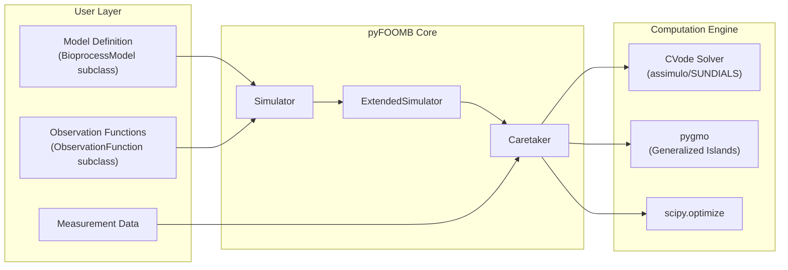
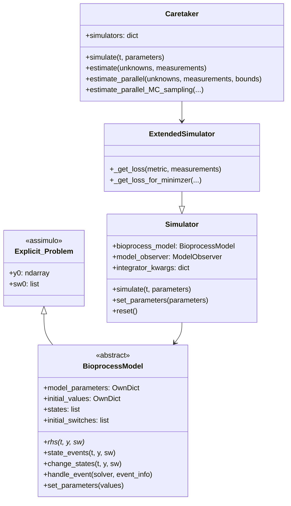
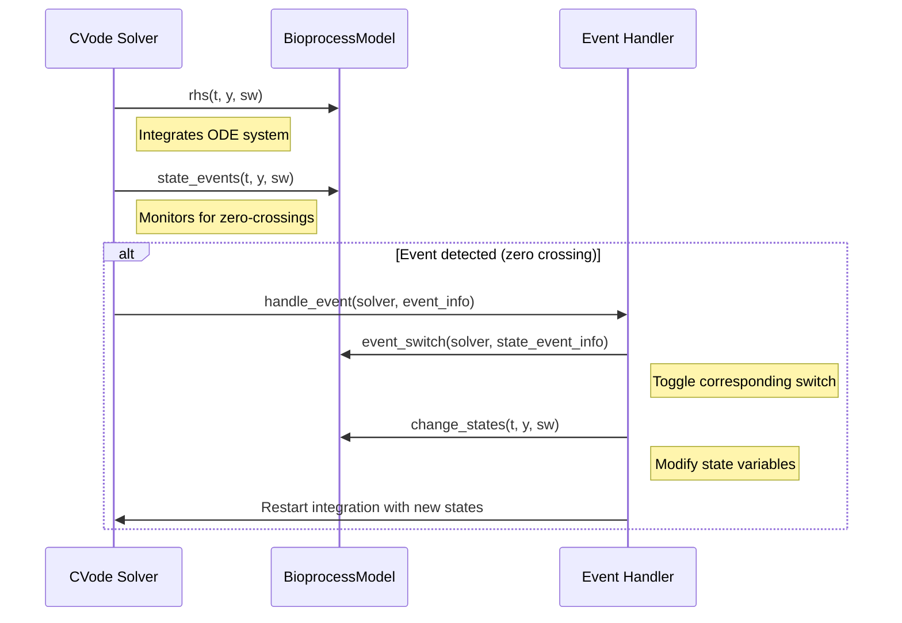
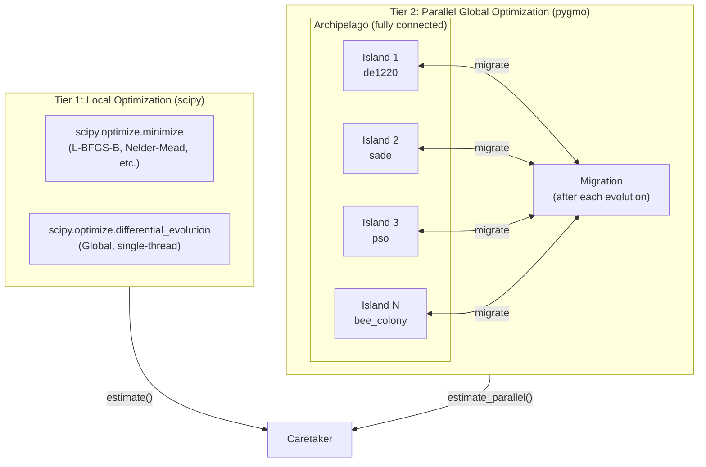
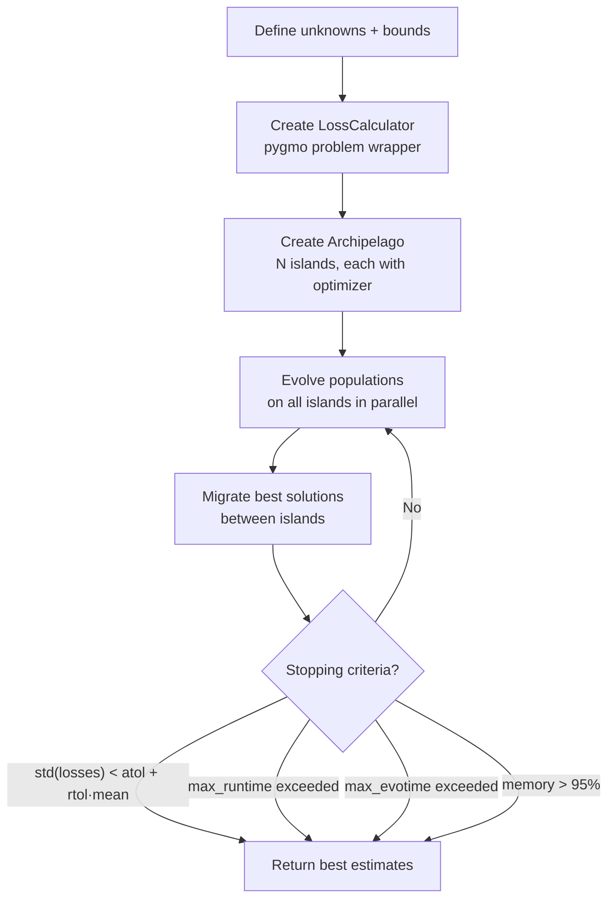
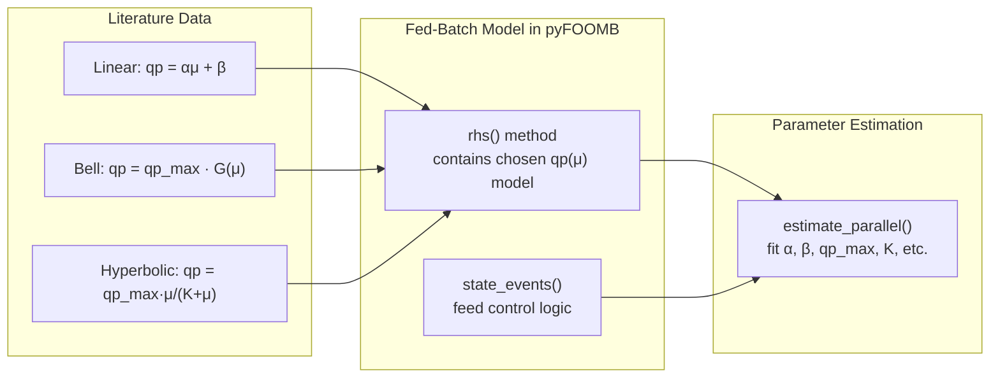

# pyFOOMB Fed-Batch Architecture — Detailed Analysis

> **Paper**: Hemmerich, J., Tenhaef, N., Wiechert, W., & Noack, S. (2021). pyFOOMB: Python framework for object-oriented modeling of bioprocesses. *Engineering in Life Sciences*, 21(3-4), 242–257. [DOI: 10.1002/elsc.202000088](https://doi.org/10.1002/elsc.202000088)

---

## 1. Overview

**pyFOOMB** (Python Framework for Object-Oriented Modelling of Bioprocesses) is a Python framework that enables formulation of bioprocess models as ODE systems, forward simulation, and parameter estimation — with first-class support for **fed-batch** processes through event handling.



---

## 2. Fed-Batch Model Architecture

### 2.1 Class Hierarchy



### 2.2 The Fed-Batch ODE System

pyFOOMB does **not** provide built-in kinetic equations. Instead, users define the complete ODE system by implementing the `rhs()` method. A typical fed-batch model implements these mass balances:

| Equation | ODE | Description |
|----------|-----|-------------|
| **Biomass** | `dX/dt = μ·X − (F/V)·X` | Growth minus dilution |
| **Substrate** | `dS/dt = (F/V)·(S_in − S) − q_s·X` | Feed input minus consumption |
| **Product** | `dP/dt = q_p·X − (F/V)·P` | Formation minus dilution |
| **Volume** | `dV/dt = F` | Feed flow rate |

Where the kinetic rate expressions (μ, q_s, q_p) are **user-defined** within `rhs()`.

### 2.3 Supported μ-qp Relationship Equations

Since pyFOOMB uses a **flexible user-defined RHS**, all three model types from the literature can be implemented:

#### Linear (Luedeking-Piret)
```python
qp = alpha * mu + beta
```
> **Support level**: ✅ Directly implementable in `rhs()`
> **Used by**: Resveratrol, VHH antibody, Crl1 lipase (SCC), GFP

#### Bell-Shaped (Gaussian)
```python
qp = qp_max * np.exp(-((mu - mu_opt)**2) / (2 * sigma**2))
```
> **Support level**: ✅ Directly implementable in `rhs()`
> **Used by**: EPG, Fab antibody, ROL lipase

#### Hyperbolic (Monod-like saturation)
```python
qp = qp_max * mu / (K_mu + mu)
```
> **Support level**: ✅ Directly implementable in `rhs()`
> **Used by**: Crl1 lipase (MCC), α-Galactosidase

### 2.4 Example: Fed-Batch Model Implementation

```python
class FedBatchModel(BioprocessModel):
    def __init__(self):
        super().__init__(
            model_parameters=['mu_max', 'K_S', 'Y_XS', 'alpha', 'beta', 
                              'F', 'S_in', 'm_s'],
            states=['P', 'S', 'V', 'X'],
            initial_switches=[False],  # Feed start event
        )

    def rhs(self, t, y, sw):
        P, S, V, X = y
        p = self.model_parameters

        # Monod growth
        mu = p['mu_max'] * S / (p['K_S'] + S)

        # Luedeking-Piret product formation (Linear model)
        qp = p['alpha'] * mu + p['beta']

        # Substrate consumption
        qs = mu / p['Y_XS'] + p['m_s']

        # Feed rate (0 before event, F after)
        F = p['F'] if sw[0] else 0.0

        # Mass balances
        dX = mu * X - (F / V) * X
        dS = (F / V) * (p['S_in'] - S) - qs * X
        dP = qp * X - (F / V) * P
        dV = F

        return [dP, dS, dV, dX]  # Alphabetical order!

    def state_events(self, t, y, sw):
        # Feed starts when S drops below 0.1 g/L
        P, S, V, X = y
        return [S - 0.1]

    def change_states(self, t, y, sw):
        return y  # No state change, just switch feed on
```

---

## 3. Event Handling for Fed-Batch

Fed-batch processes require **discrete events** (feed start/stop, bolus additions, sampling). pyFOOMB handles these via the assimulo event system:



### Key Methods:

| Method | Purpose | Example Use Case |
|--------|---------|-----------------|
| `state_events(t, y, sw)` | Define zero-crossing conditions | `S - S_threshold` → trigger feed start |
| `change_states(t, y, sw)` | Modify states when event fires | Add substrate bolus: `S = S + S_add` |
| `handle_event(solver, event_info)` | Orchestrate the event response | Toggle switches, restart solver |

---

## 4. Optimization Architecture

### 4.1 Two-Tier Optimization Strategy

pyFOOMB provides two levels of optimization:



### 4.2 Available pygmo Optimizers (17 algorithms)

| Algorithm | Type | Key Parameters |
|-----------|------|----------------|
| `bee_colony` | Swarm | limit=2, gen=10 |
| `compass_search` | Direct search | max_fevals=100 |
| `de` | Differential Evolution | gen=10, ftol=1e-8 |
| `de1220` | Self-adaptive DE | gen=10 (default) |
| `gaco` | Ant Colony | gen=10 |
| `ihs` | Harmony Search | gen=40 |
| `maco` | Multi-obj Ant Colony | gen=10 |
| `mbh` | Monotonic Basin Hopping | inner: compass_search |
| `moead` | Multi-obj Decomposition | gen=10 |
| `nlopt` | Various (L-BFGS) | solver='lbfgs' |
| `nsga2` | Multi-objective GA | gen=10 |
| `nspso` | Multi-obj PSO | gen=10 |
| `pso` | Particle Swarm | gen=10 |
| `pso_gen` | Generational PSO | gen=10 |
| `sade` | Self-adaptive DE | gen=10, variant_adptv=2 |
| `sea` | Simple EA | gen=40 |
| `sga` | Simple GA | gen=10 |
| `simulated_annealing` | SA | (default params) |

### 4.3 Generalized Island Model Flow



### 4.4 Loss Function Pipeline

The objective function chain:

```
Caretaker.estimate_parallel()
  └── LossCalculator.fitness(x)        # pygmo interface
        └── LossCalculator.get_model_loss()
              └── caretaker.loss_function()
                    └── ExtendedSimulator._get_loss()
                          ├── simulate(t, parameters)
                          │     └── CVode integration
                          └── compare with Measurements
                                └── metric: negLL / SS / WSS
```

### 4.5 Metrics for Parameter Estimation

| Metric | Formula | When to Use |
|--------|---------|-------------|
| `negLL` | Negative log-likelihood | When measurement errors are known (σ) |
| `SS` | Sum of squares | Simple, unweighted fitting |
| `WSS` | Weighted sum of squares | When measurements have different scales |

---

## 5. Connection to μ-qp Relationships

### How Fed-Batch Optimization Uses μ-qp Models



The workflow is:
1. **Choose** a μ-qp relationship model from literature
2. **Implement** it in a `BioprocessModel.rhs()` subclass alongside mass balances
3. **Define events** for feed control (substrate depletion triggers, time-based feeds)
4. **Estimate** kinetic parameters (α, β, μ_max, K_S, etc.) using `estimate_parallel()` with experimental fed-batch data
5. **Optimize** feed strategy by simulating with different feed profiles

---

## 6. File-Level Architecture Map

```
pyfoomb/
├── modelling.py          # BioprocessModel (abstract ODE base class)
│                         # ObservationFunction (maps states → measurements)
├── simulation.py         # Simulator (forward simulation with CVode)
│                         # ExtendedSimulator (adds loss calculation)
│                         # ModelObserver (manages observation functions)
├── caretaker.py          # Caretaker (main API: simulate + estimate)
│                         # Local: scipy.optimize.minimize / diff_evolution
│                         # Parallel: pygmo archipelago
├── generalized_islands.py # LossCalculator (pygmo problem wrapper)
│                          # PygmoOptimizers (17 algorithms + defaults)
│                          # PyfoombArchipelago (archipelago subclass)
│                          # ParallelEstimationInfo (result container)
├── datatypes.py          # TimeSeries, ModelState, Observation, Measurement
├── parameter.py          # Parameter, ParameterMapper, ParameterManager
├── model_checking.py     # ModelChecker (sanity checks on models)
├── oed.py                # CovOptimality (optimal experimental design)
├── constants.py          # Global constants and messages
├── utils.py              # Helpers, Calculations, OwnDict
└── visualization.py      # Plotting utilities
```

---

## 7. Summary

| Feature | Implementation | Key File |
|---------|---------------|----------|
| **ODE System** | User-defined `rhs()` | [modelling.py](file:///home/yashashwi-s/bpdd/pyFOOMB/pyfoomb/modelling.py) |
| **Fed-Batch Events** | `state_events()` + `change_states()` | [modelling.py](file:///home/yashashwi-s/bpdd/pyFOOMB/pyfoomb/modelling.py) |
| **ODE Integration** | CVode (SUNDIALS via assimulo) | [simulation.py](file:///home/yashashwi-s/bpdd/pyFOOMB/pyfoomb/simulation.py) |
| **Local Estimation** | scipy minimize / differential_evolution | [caretaker.py](file:///home/yashashwi-s/bpdd/pyFOOMB/pyfoomb/caretaker.py) |
| **Global Estimation** | pygmo generalized island model (17 algorithms) | [generalized_islands.py](file:///home/yashashwi-s/bpdd/pyFOOMB/pyfoomb/generalized_islands.py) |
| **μ-qp Models** | Any model (linear/bell/hyperbolic) in `rhs()` | User code |
| **Metrics** | negLL, SS, WSS | [caretaker.py](file:///home/yashashwi-s/bpdd/pyFOOMB/pyfoomb/caretaker.py) |

> **Key Insight**: pyFOOMB's strength is its **flexibility** — it doesn't hardcode kinetic models. Instead, users implement any μ-qp relationship (linear, bell-shaped, or hyperbolic) in their `rhs()` method, and pyFOOMB handles the simulation, event management, and parameter estimation infrastructure. The parallel optimization via pygmo's generalized island model enables robust global parameter estimation even for complex, non-convex fed-batch models.
