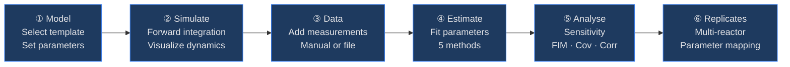
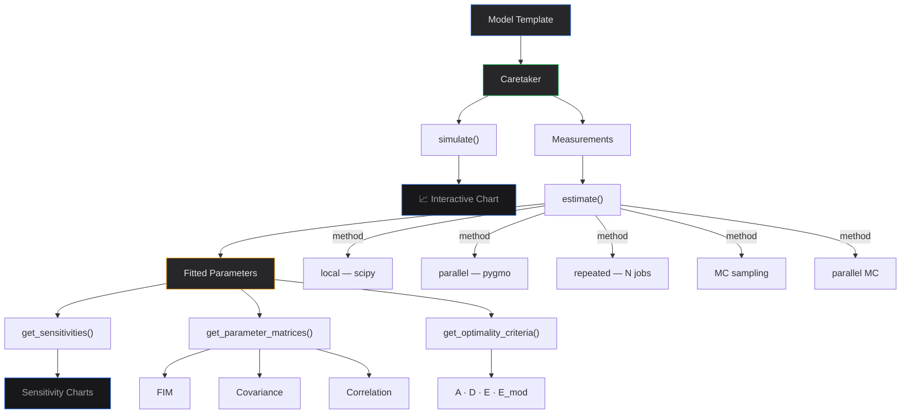

# pyFOOMB Web GUI

Web interface for the [pyFOOMB](https://doi.org/10.1002/elsc.202000088) bioprocess modelling framework.

## Architecture


## Workflow



## Data Flow



## Quick Start

```bash
# Local (requires conda env 'bpdd' with pyfoomb installed)
./start.sh

# Docker
docker build -t pyfoomb-web .
docker run -p 3000:3000 -p 8000:8000 pyfoomb-web
```

| | URL |
|---|---|
| Frontend | http://localhost:3000 |
| API docs | http://localhost:8000/docs |

## File Structure

```
web/
├── start.sh                     # Launch both servers
├── Dockerfile
├── backend/
│   ├── main.py                  # FastAPI entry point
│   ├── routers/
│   │   ├── models.py            # Template-based model CRUD
│   │   ├── simulation.py        # Forward simulation
│   │   ├── data.py              # Measurement CRUD + file upload
│   │   ├── estimation.py        # 5 estimation methods
│   │   ├── analysis.py          # Sensitivity, FIM, Cov, Corr, OED
│   │   └── parameters.py        # Replicates, mappings, integrator
│   └── services/
│       ├── model_store.py       # In-memory session store
│       ├── model_templates.py   # 8 pre-built ODE models
│       └── serializers.py       # pyFOOMB → JSON
└── frontend/
    ├── src/app/                  # 8 Next.js pages
    ├── src/components/           # Sidebar, Math (KaTeX)
    └── src/lib/                  # API client, paramToTex
```

## API Coverage

### ✅ Implemented

| pyFOOMB Method | Endpoint |
|---|---|
| `Caretaker.__init__` | `POST /api/models` |
| `Caretaker.simulate` | `POST /api/models/{id}/simulate` |
| `Caretaker.estimate` | `POST /api/models/{id}/estimate` |
| `Caretaker.estimate_parallel` | ↑ `method=parallel` |
| `Caretaker.estimate_repeatedly` | ↑ `method=repeated` |
| `Caretaker.estimate_MC_sampling` | ↑ `method=mc` |
| `Caretaker.estimate_parallel_MC_sampling` | ↑ `method=parallel_mc` |
| `Caretaker.get_sensitivities` | `POST /api/models/{id}/sensitivities` |
| `Caretaker.get_parameter_matrices` | `POST /api/models/{id}/parameter-matrices` |
| `Caretaker.get_parameter_uncertainties` | `POST /api/models/{id}/parameter-uncertainties` |
| `Caretaker.get_optimality_criteria` | `POST /api/models/{id}/optimality-criteria` |
| `Caretaker.set_parameters` | `PUT /api/models/{id}/parameters` |
| `Caretaker.add_replicate` | `POST /api/models/{id}/replicates` |
| `Caretaker.apply_mappings` | `POST /api/models/{id}/mappings` |
| `Caretaker.set_integrator_kwargs` | `PUT /api/models/{id}/integrator` |
| `ModelChecker` | `POST /api/models/{id}/check` |
| `Measurement` | `POST /api/models/{id}/measurements` |
| `ObservationFunction` | `POST /api/models/{id}/observation-functions` |

### 🔲 Not Yet Implemented

| Feature | Priority |
|---|---|
| `estimate_parallel_continued` | Medium |
| `compare_estimates_many` (MC overlay) | Medium |
| Error model per Measurement | Medium |
| CSV/XLSX drag-and-drop upload | Medium |
| Custom model equations (non-template) | Low |
| `optimizer_kwargs` configuration | Low |

## Tech Stack

| Layer | Technology |
|---|---|
| Frontend | Next.js 16 · React 19 · Tailwind v4 · Recharts · KaTeX |
| Backend | FastAPI · Python 3.9 · uvicorn |
| ODE Solver | assimulo (CVode / SUNDIALS) |
| Optimization | pygmo (generalized island model) |
| Data | numpy · pandas · scipy |
