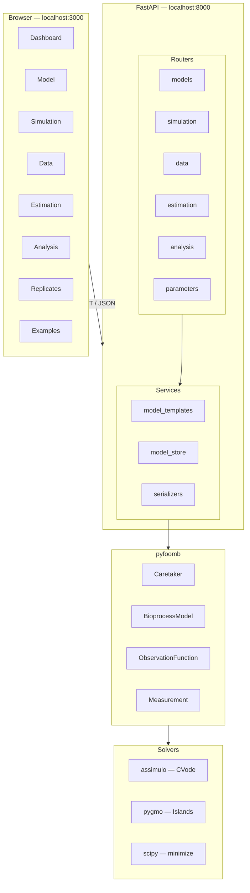
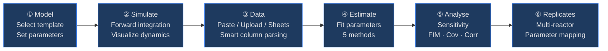

# pyFOOMB Web GUI

Web interface for the [pyFOOMB](https://doi.org/10.1002/elsc.202000088) bioprocess modelling framework.

## Architecture



## Workflow



## Pages — What They Do

### ① Model

**Purpose**: Define your bioprocess system.

Select a pre-built ODE template (exponential decay, logistic growth, Monod, etc.) and enter **kinetic parameters** — these are your initial guesses from literature or prior experience. They represent your *hypothesis* about how the system behaves.

- **Model parameters** (`µ_max`, `K_S`, `Y_XS`): kinetic constants
- **Initial values** (`X0`, `S0`, `P0`): starting concentrations

### ② Simulation

**Purpose**: "What would happen if my model is correct?"

Runs a **forward simulation** using your current parameters. The resulting curves are *predictions*, not real data. Use this to sanity-check your model — do the dynamics look reasonable? Does biomass grow, does substrate deplete?

**Measurement overlay**: If you have loaded data (from the Data page or Examples), stored measurements appear as **scatter points** on top of the simulation curves, letting you visually compare model predictions vs. reality.

> **Adding real data does NOT change the simulation.** The simulation always uses the current parameters. After estimation, you can update parameters to the fitted values and re-simulate to see the model match.

### ③ Data

**Purpose**: Import real experimental measurements.

Three import methods:

| Method | Description |
|--------|-------------|
| **Paste** | Paste CSV or tab-separated text. Smart column parsing: `Biomass (X) [g/L]` → state `X` |
| **Upload** | Drag-and-drop `.csv` / `.xlsx` files |
| **Google Sheets** | Paste a public Google Sheets URL |

Flexible column format:
```
Time (h), Biomass (X) [g/L], Substrate (S) [g/L], Product (P) [g/L]
0, 0.5, 10.0, 0.0
4, 2.8, 1.2, 0.1
6, 8.5, 0.2, 0.5
```
- Column names auto-parsed (extracts state from parentheses)
- Annotations in values like `2.1 (Feed starts)` are handled
- Columns can be in any order

### ④ Estimation

**Purpose**: "What parameters actually explain my data?"

Fits model parameters to your real measurements by minimizing the mismatch between simulation and data.

| Method | When to use |
|--------|------------|
| **Local (scipy)** | Quick single-point fit. Good starting point |
| **Parallel (pygmo)** | Multi-island global optimization. Most robust |
| **Repeated** | Run N local fits from random starts |
| **MC Sampling** | Monte Carlo — generates parameter distributions |
| **Parallel MC** | Parallelized MC sampling |

| Metric | When to use |
|--------|------------|
| **SS** | No error bars on data (sum of squares) |
| **WSS** | Data has error bars (weighted sum of squares) |
| **negLL** | Data has error bars (maximum likelihood) |

### ⑤ Analysis

**Purpose**: "How confident am I in these estimates?"

| Analysis | What it tells you |
|----------|-------------------|
| **Sensitivity** | Which parameters influence each state. Flat sensitivities = unidentifiable parameter |
| **FIM** | Fisher Information Matrix — how much information your experiment provides about each parameter |
| **Covariance** | Parameter variances and covariances |
| **Correlation** | Parameter correlations. Values near ±1 = parameters are confounded |
| **Uncertainties** | Confidence intervals: `µ_max = 0.52 ± 0.08` |
| **Optimality (OED)** | A/D/E criteria for optimal experimental design |

### ⑥ Replicates

**Purpose**: Multiple experiments, shared kinetics.

When you run several fermentations with different initial conditions but the same organism, replicates let you:
- **Share** kinetic parameters across experiments (same `µ_max` everywhere)
- **Allow** different initial conditions per experiment
- **Estimate** from all data simultaneously — more robust

### ⑦ Examples

Pre-configured models from the pyFOOMB notebook examples. Two loading modes:
- **Load**: uses hardcoded reference data
- **Load + Data**: generates smart synthetic noisy data tuned to each model's dynamics

## Quick Start

```bash
# Local (requires conda env 'bpdd' with pyfoomb installed)
./start.sh

# Docker
docker build -t pyfoomb-web .
docker run -p 3000:3000 -p 8000:8000 pyfoomb-web
```

| | URL |
|---|---|
| Frontend | http://localhost:3000 |
| API docs | http://localhost:8000/docs |

## File Structure

```
web/
├── start.sh                     # Launch both servers
├── Dockerfile
├── backend/
│   ├── main.py                  # FastAPI entry point
│   ├── test_api.py              # 39 tests, 9 test classes
│   ├── routers/
│   │   ├── models.py            # Template-based model CRUD
│   │   ├── simulation.py        # Forward simulation
│   │   ├── data.py              # Measurement import (paste/upload/sheets/generate)
│   │   ├── estimation.py        # 5 estimation methods
│   │   ├── analysis.py          # Sensitivity, FIM, Cov, Corr, OED
│   │   └── parameters.py        # Replicates, mappings, integrator
│   └── services/
│       ├── model_store.py       # In-memory session store
│       ├── model_templates.py   # 8 pre-built ODE models
│       └── serializers.py       # pyFOOMB → JSON
└── frontend/
    ├── src/app/                  # 8 Next.js pages
    ├── src/components/           # Sidebar, Math (KaTeX), Toast, Providers
    └── src/lib/                  # API client, paramToTex
```

## API Coverage

| pyFOOMB Method | Endpoint | Status |
|---|---|---|
| `Caretaker.__init__` | `POST /api/models` | ✅ |
| `Caretaker.simulate` | `POST /api/models/{id}/simulate` | ✅ |
| `Caretaker.estimate` | `POST /api/models/{id}/estimate` | ✅ |
| `Caretaker.estimate_parallel` | ↑ `method=parallel` | ✅ |
| `Caretaker.estimate_repeatedly` | ↑ `method=repeated` | ✅ |
| `Caretaker.estimate_MC_sampling` | ↑ `method=mc` | ✅ |
| `Caretaker.estimate_parallel_MC_sampling` | ↑ `method=parallel_mc` | ✅ |
| `Caretaker.estimate_parallel_continued` | `POST /api/models/{id}/estimate-continue` | ✅ |
| `Caretaker.get_sensitivities` | `POST /api/models/{id}/sensitivities` | ✅ |
| `Caretaker.get_parameter_matrices` | `POST /api/models/{id}/parameter-matrices` | ✅ |
| `Caretaker.get_parameter_uncertainties` | `POST /api/models/{id}/parameter-uncertainties` | ✅ |
| `Caretaker.get_optimality_criteria` | `POST /api/models/{id}/optimality-criteria` | ✅ |
| `Caretaker.set_parameters` | `PUT /api/models/{id}/parameters` | ✅ |
| `Caretaker.reset` | `POST /api/models/{id}/reset` | ✅ |
| `Caretaker.add_replicate` | `POST /api/models/{id}/replicates` | ✅ |
| `Caretaker.apply_mappings` | `POST /api/models/{id}/mappings` | ✅ |
| `Caretaker.set_integrator_kwargs` | `PUT /api/models/{id}/integrator` | ✅ |
| `ModelChecker` | `POST /api/models/{id}/check` | ✅ |
| `Measurement` | `POST /api/models/{id}/measurements` | ✅ |
| `Measurement` (file upload) | `POST /api/models/{id}/measurements/upload` | ✅ |
| `Measurement` (paste text) | `POST /api/models/{id}/measurements/paste` | ✅ |
| `Measurement` (Google Sheets) | `POST /api/models/{id}/measurements/sheets` | ✅ |
| Synthetic data generation | `POST /api/models/{id}/generate-data` | ✅ |
| Error model per Measurement | `PUT /api/models/{id}/measurements/{name}/error-model` | ✅ |
| `ObservationFunction` | `POST /api/models/{id}/observation-functions` | ✅ |
| `optimizer_kwargs` | `GET/PUT /api/models/{id}/optimizer-kwargs` | ✅ |

### Not Yet Implemented

| Feature | Priority |
|---|---|
| Custom model equations (non-template ODE editor) | Low |
| `compare_estimates_many` (MC overlay visualization) | Low |

## Running Tests

```bash
cd web/backend
python -m pytest test_api.py -v
```

39 tests covering: model CRUD, simulation (all templates), measurements (JSON/CSV/paste), estimation (local/parallel/MC), analysis (sensitivities/FIM/uncertainties/OED), parameter management, and end-to-end workflows.

## Tech Stack

| Layer | Technology |
|---|---|
| Frontend | Next.js 16 · React 19 · Tailwind v4 · Recharts · KaTeX |
| Backend | FastAPI · Python 3.9 · uvicorn |
| ODE Solver | assimulo (CVode / SUNDIALS) |
| Optimization | pygmo (generalized island model) |
| Data | numpy · pandas · scipy |
